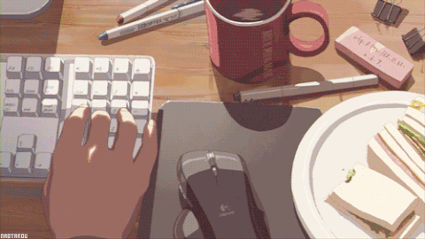

  

#

  Atualmente estudando Análise e Desenvolvimento de Sistemas na Universidade de Marília. Acredito que a busca contínua
  por conhecimento é a chave para o sucesso pessoal e profissional, por isso busco sempre me aprimorar meus
  conhecimentos. Atualmente focando meus estudos para a área de Desenvolvimento Web.

  #

  

<h3 align="left">Minhas Redes</h3>

<h3 align="left">My Skills ~</h3>

  
  
  
  
   
   
  
  
  
  
  
  
  
  
  
  

#
